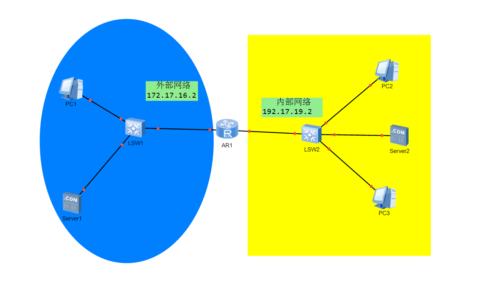
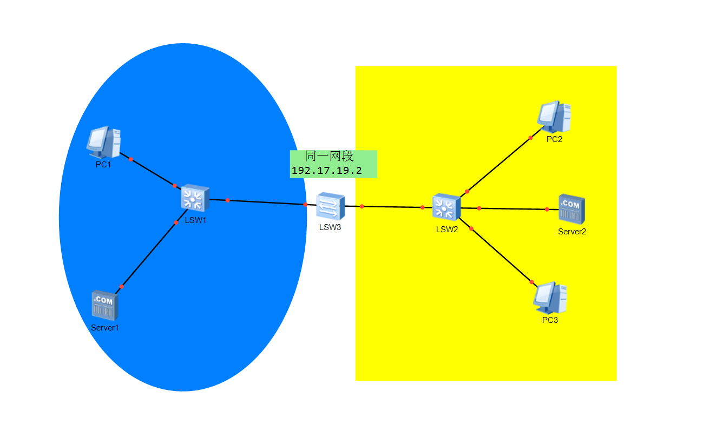
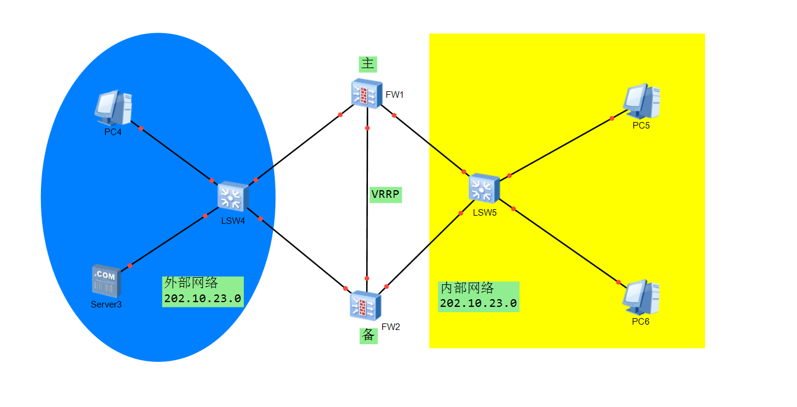
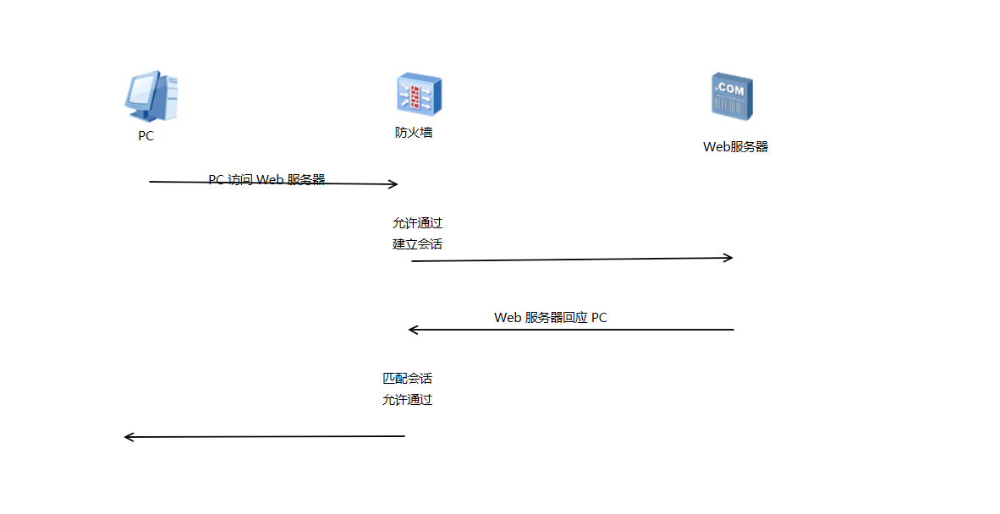
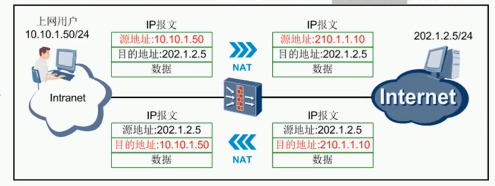
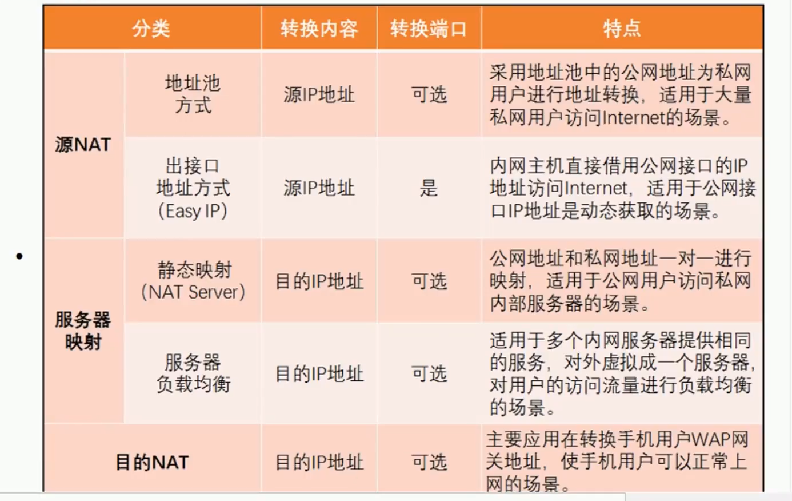
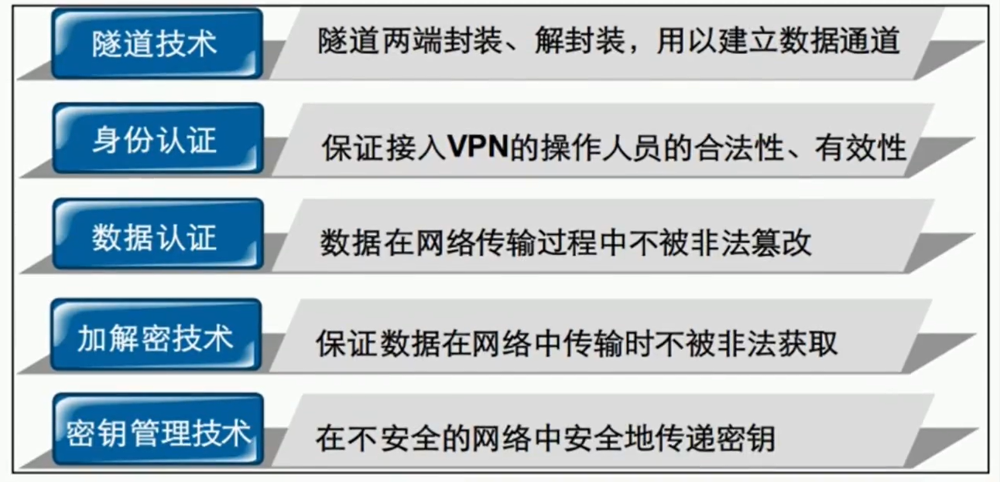
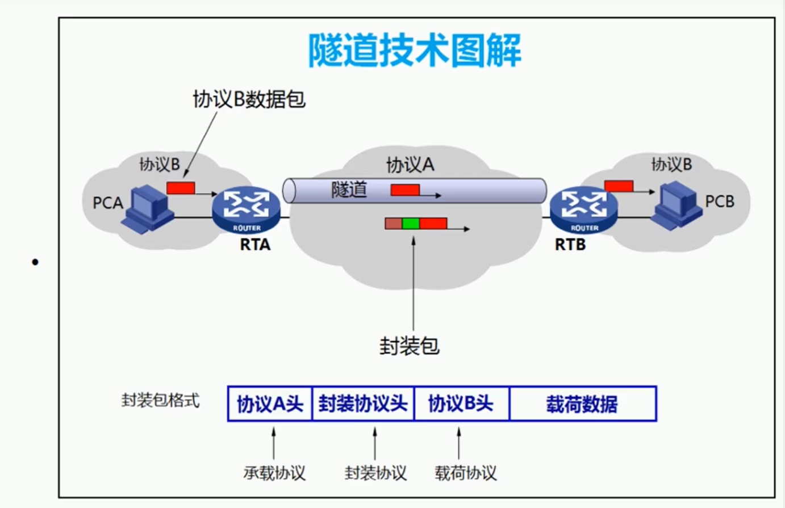
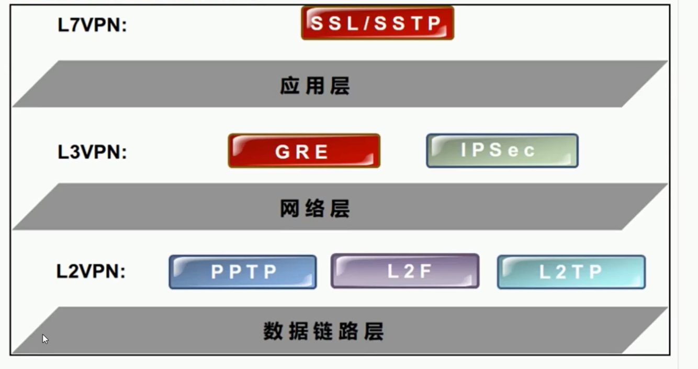
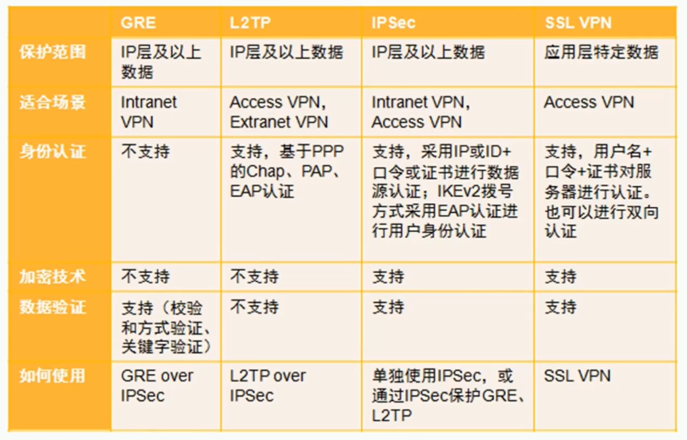

### 了解扩展

#### 防火墙发展简史

---

**包过滤防火墙**，给予ACL，通过检查数据流中每一个数据包的源IP地址、目的IP地址、源端口号、目的端口号、协议类型等因素或它们的组合来确定是否允许该数据包通过。

**代理防火墙** , 代理防火墙也叫应用层网关（Appliaction Gateway）防火墙。隔绝访问者与服务器直接建立连接。 

**状态监测防火墙**（发展史上的里程碑）， 一种能够提供**状态数据包检查**或**状态查看**功能的[防火墙](https://baike.baidu.com/item/防火墙)，能够持续追踪穿过这个防火墙的各种网络连接（例如[TCP](https://baike.baidu.com/item/TCP)与[UDP](https://baike.baidu.com/item/UDP)连接）的状态。这种防火墙被设计来区分不同连接种类下的合法数据包。只有匹配主动连接的数据包才能够被允许穿过防火墙，其他的数据包都会被拒绝。 

**统一威胁管理**，是指一个功能全面的安全产品，它能防范多种威胁。UTM产品通常包括防火墙，防病毒软件，内容过滤和垃圾邮件过滤器。 

**下一代防火墙**是一款可以全面应对应用层威胁的高性能[防火墙](https://baike.baidu.com/item/防火墙/52767)。通过深入洞察网络流量中的用户、应用和内容，并借助全新的高性能单路径异构并行处理[引擎](https://baike.baidu.com/item/引擎/2043)，NGFW能够为用户提供有效的应用层一体化安全防护，帮助用户安全地开展业务并简化用户的[网络安全](https://baike.baidu.com/item/网络安全/343664)架构。 

#### 防火墙的优缺点：

**包过滤**：

* 优点：

~~~
（1）包过滤防火墙对每条传入和传出网络的包实行低水平控制；

（2）包过滤防火墙检查每个IP包的字段，包括源地址、目的地址、协议、端口等，防火墙将基于这些信息应用过滤规则；

（3）包过滤防火墙可以识别和丢弃带欺骗性源IP地址的包；

（4） 包过滤防火墙对用户和应用透明，用户无需改变习惯，技术实现简单，运行速度快  

~~~

* 缺点：

~~~
（1）所有可能会用到的端口都必须静态放开。若允许建立HTTP 连接, 就需要开放1024 以上所有端口, 这增加了被攻击的可能性。
（2）包过滤防火墙不能对数据传输状态进行判断。如接收到一个ACK数据包, 就认为这是一个已建立的连接, 这会导致许多安全隐患, 一些恶意扫描和拒绝服务攻击就是利用了这个缺陷。
（3）包过滤防火墙无法过滤审核数据包上层的内容。即使通过防火墙的数据包有攻击性或包含病毒代码, 也无法进行控制和阻断。
~~~

---

**代理防火墙**

* 优点：

~~~
（1）应用层网关支持可靠的用户认证并提供详细的注册信息。
（2）用于应用层的过滤规则更易配置和测试。
（3）代理工作在客户机和真实服务器间，完全控制会话，可提供详细的日志和安全审计功能。
（4）应用代理防火墙可以被配置成唯一的可被外部看见的主机，从而隐藏内部网络的IP地址，保护内部主机免受外部主机进攻。
（5）通过代理访问因特网可以解决合法IP地址不够用的问题。
~~~

* 缺点：

~~~
（1）当用户对内部网络网关的吞吐量要求较高时，代理防火墙会成为内外网络间通信的瓶颈。
（2）应用代理服务器存在兼容性问题。代理服务器通常具有解释应用层命令的功能，因此，可能需要提供很多不同的代理服务器，而且每一种应用升级时，一般代理服务程序也要升级，所以能提供的服务和可伸缩性是有限的。
~~~

**状态检测防火墙**

* 优点：

~~~
（1）执行效率高：状态检测防火墙工作在协议栈的较低层，通过防火墙的所有的数据包都在低层处理，减少高层协议头的开销；此外防火墙中一个连接建立后不再需要对该连接进行其他处理。
（2）良好的伸缩性和扩展性：状态检测防火墙不区分每个具体的应用，动态产生新应用的新规则，无需重新编码。
（3）安全性高：状态检测防火墙检测所有应用层的数据包；此外状态检测防火墙还实现了基于UDP应用的安全，防火墙保存通过网关的每一个连接的状态信息，可以很好的降低拒绝服务和分布式拒绝服务攻击的风险。
~~~

* 缺点：

~~~
（1）状态检测防火墙虽然继承了包过滤防火墙和应用网关防火墙的优点，克服了它们的缺点，但它仍只是检测数据包的第三层信息，无法彻底的识别数据包中大量的垃圾邮件、广告以及木马程序等等。
（2）包过滤防火墙和网关代理防火墙以及状态检测防火墙都有固有的无法克服的缺陷，不能满足用户对于安全性的不断的要求，于是深度包检测防火墙技术被提出了
~~~

#### 防火墙特征：

* 逻辑区域过滤器。
* 隐藏内网网络结构。
* 自生安全保障。
* 主动防御攻击。

#### 防火墙安全域分类

**常用：**

* 非受信区域**Untrust**，低安全级别的安全区域，安全级别为5
* 非军事化区域**DMZ**，中等安全级别的安全域，安全级别为50
* 受信区域**Trust**，较高安全级别的安全域，安全级别为85

**传统：**

* l2trust
* l2untrust

#### 防火墙安全域的方向

* 入方向（Inbound）,报文从**低级别**的安全域向**高级别**的安全域流动。
* 出方向（Outbound）,报文从**高级别**的安全域向**低级别**的安全域流动。

#### 防火墙基本功能（深度检测技术）

&ensp; **深度报文检测（DPI）：**普通报文检测仅仅分析IP包的四层一下的内容，包括源地址、目的地址、源端口、目的端口以及协议类型，而DPI则在此基础上，增加了对应用层的分析，**可识别各种应用及其内容**。

&ensp; **深度数据流检测技术（DFI）：** 通过分析网络数据流量行为特征来识别网络应用。DFI 通过及时分析某种应用数据流和特征模型进行比较，因此检测的准确性取决于特征模型的准确性。

**DFI技术与DPI技术的区别**

1、处理速度

* DFI 不进行拆包操作，处理速度快。
* DPI 技术要逐包进行拆包操作，并于后台数据库进行对比，处理速度慢。

2、维护成本方面

* DFI 维护成本低
* 基于DPI技术的带宽管理系统需要配合新协议和新型应用，不断升级后台应用数据库，维护成本高。

3、识别准确率方面

* DPI 采用逐包分析、模式匹配技术，可以准确识别流量中的具体应用类型和协议。而DFI 仅对流量行为分析，只能对应用类型进行大致分类。
* 若数据包加密传输，采用DPI 方式的流控制技术则不能识别其具体应用，而DFI 方式的流控制技术则不受影响。

### 防火墙

* 位于多个信任程度不同的网络之间（如企业内网和Internet之间）的设备。
* 对两个网络之间的通信进行控制，通过强制实施统一的安全策略，防止对重要信息资源的非法存取和访问以达到保护系统安全的目的。
* 防火墙 = 硬件 + 软件 + 控制策略
  * 宽松控制策略：除非明确禁止，否则允许。
  * 限制控制策略：除非明确允许，否则禁止。

---

#### 防火墙和路由器实现安全控制的区别

| --         | 防火墙                             | 路由器                             |
| ---------- | ---------------------------------- | ---------------------------------- |
| 背景       | 产生于人们对安全性的需求。         | 基于对网络数据包路由而产生的。     |
| 目的       | 保证任何非允许的数据包 **不通** 。 | 保持网络和数据的 **通**。          |
| 核心技术   | 基于状态包过滤的应用级信息流过滤   | 基于ACL简单的包过滤                |
| 防攻击能力 | 具有应用层防范功能                 | 普通路由器不具备有应用层的防范功能 |

#### 防火墙分类

* 按照形态：

  * 硬件防火墙
* 软件防火墙
  
* 按照保护对象：
  * 单机防火墙
  * 网络防火墙
* 按照访问控制方式：
  * 包过滤防火墙
  * 代理防火墙
  * 状态检测防火墙

---

#### 防火墙工作模式

| ---      | ---                                                 |
| -------- | --------------------------------------------------- |
| 路由模式 | 每个接口均 有 IP 地址 |
| 透明模式 | 每个接口均 无 IP 地址 |
| 混合模式 | 部分接口有 IP 地址                                  |

**路由模式：** 支持更多安全特性，对网络拓扑有影响。

**透明模式：** 对网络拓扑透明，对网络拓扑无影响。

**混合模式：** 目前只用于提供双机热备的特殊应用中，别的环境下不建议使用，但是可以使用。

---

#### 安全区域

**区域 ：** Zone，化地而治，等级森严，在防火墙上引入的一个重要的逻辑概念。

*  是 一个或者多个接口 的集合。
* 一个接口所连网络只能属于一个区域中。
* 一个区域可以包含多个接口所连的网络。
* 通过区域来划分网络、标识报文流动的 **路线** ，当报文在不同区域之间流动时，才会触发安全检测。
* 每个区域具有唯一的安全优先级。
* 默认情况下：
  * 报文在不同的安全区域之间流动时，才会触发安全检查。
  * 报文在同一个安全区域之间流动时，不会触发安全检查。
  * 某些防火墙也支持对同一个安全区域内经过防火墙流量进行安全检查。
* 大部分安全策略都基于安全区域实施。

##### 默认区域：

防火墙内置，无法修改安全级别，无法删除。

| 名称                | 安全级别                  | 场景       |
| ------------------- | ------------------------- | ---------- |
| 虚拟区（VZone）     | 最低安全级别，安全级别为0 | 虚拟防火墙 |
| 非受信区（Untrust） | 低等级级别，安全级别为5   | 外部防火墙 |
| 非军事化区（DMZ）   | 中等级别，安全级别为50    | 公共服务器 |
| 受信区（trust）     | 较高级别，安全级别为85    | 内部网络   |
| 本地（local）       | 最高级别，安全级别为100   | 防火墙本身 |

 

##### 区域方向:

| --                 | --                                                           |
| ------------------ | ------------------------------------------------------------ |
| 入方向（inbound）  | 数据由低向高安全级别的区域传输的反向 |
| 出方向（outbound） | 数据由高向低安全级别的区域传输的方向 |

#### 状态检测与会话机制

* 当报文到达防火墙后，防火墙允许报文通过，同时针对 PC 访问 Web 服务器的这个行为建立会话(Session) ，会话中包含了PC发出的报文信息，如地址和端口。
* 当Web服务器回应给 PC 的报文到达防火墙时，防火墙会把报文中的信息与会话中的信息进行对比 ，发现报文中的信息与会话中的信息相匹配，比符合协议规范对后续包的定义，则认为这个报文属于 PC 访问Web服务器行为的后续回应报文，直接允许这个报文通过。

##### 状态检测防火墙会话机制总结：

* 状态检测防火墙使用基于连接状态的检测机制，将通信双方之间交互属于同一连接的所有报文都作为整体的 **数据流 **来对待，同一个数据流内的报文不在时孤立的个体，而是存在联系的。
* 为首包建立会话 ，后续报文直接根据会话进行转发，提高了转发效率。
* **五元组**，相同的报文即可认为属于同一条数据流，在防火墙上就可以唯一确定一条连接。
* 防火墙在一段时间后删除会话，该时间称为会话的老化时间。

##### 常见协议创建会话：

| 协议                      | 开启状态检测         |
| ------------------------- | -------------------- |
| TCP（SYS报文）            | 创建会话，转发报文   |
| TCP（SYN+ACK、ACK报文）   | 不创建会话，丢弃报文 |
| UDP                       | 创建会话，转发报文   |
| ICMP（Ping 回显请求报文） | 创建会话，转发报文   |
| ICMP（Ping 回显应答报文） | 不创建会话，丢弃报文 |
| ICMP（其他报文）          | 不创建会话，转发报文 |

#### 安全策略

##### 安全策略原理：

根据定义的规则，对经过防火墙流量进行筛选，并更具关键字确定筛选出的流量如何进行下一步操作，可以基于 IP 、 端口 、 协议等属性进行细化控制。

##### 默认策略：

* 域间的所有方向都禁止报文通过。
* 域内数据流动不受限制。
* 路由、ARP等底层协议一般是，不受安全策略控制的，直接允许通过（并非绝对）。

##### 安全策略的应用方向：

* 对于同一条数据流，在访问发起的方向上应用安全策略即可，反向报文不需要额外的策略。（会话机制）

  

##### 安全策略的匹配：

* 策略的优先级按照配置顺序进行排列，越先（靠前）配置，优先级越高，越先匹配。

* 如果报文匹配到一条策略就不在继续匹配剩下策略。
* 如果没有匹配到任何策略就按缺省包过滤处理。

#### ASPF（针对应用层包过滤）

* 为了解决多通道协议的转发而引入。
* 对这种协议的应用层数据进行解析，识别 这些协议协商出来的端口号，从而自动 为其 开放 相应的访问规则，解决这些协议不能正常转发的问题。
* 并且动态生成Server-map表项，即简化了安全策略的配置又确保了安全信。

**Server-map：**该表项主要用于存放一种映射关系，设备根据这种映射关系对报文的地址进行转换，并转发，不在受安全策略的控制。

---

#### NAT

**NAT：**网络地址转换，对 IP 地址或端口号进行转换。

##### NAT地址池

是一个虚拟的概念，它形象的把公网 IP 地址的集合 比喻成一个存放 IP地址的池子或容器，防火墙在应用源NAT功能时就是从地址池中挑选一个公网 IP ，然后对私网 IP 进行转换（挑选那个公网 IP 是随机的，和配置顺序、IP 大小等因素都没有关系）。

##### NAT 生成 Server-map 的两种情况

* 配置 NAT-Server 后，生成静态表项。

  * **用于存放私网 IP 与公网 IP 地址映射关系。**
  * 不配置**no-reverse**参数时，生成**正反两个方向**Server-map。
  * 配置**no-reverse**参数时，只生成**正方向**Server-map。

* 配置 NAT No-PAI 后，流量触发 建立Server-map 表。

  * 用于存放私网 IP地址与公网 IP地址的映射关系。

  
##### NAT 分类

---

#### VPN基础

**VPN：** 虚拟专用网络。

| --   | --                                                           |
| ---- | ------------------------------------------------------------ |
| VPN  | 通过公共网络建立私有网络，并提供一定的安全性和服务质量保证。IETF草案对基于IP的VPN的定义是：使用IP机制仿真出一个私有的广域网 |
| 虚拟 | 用户不需要拥有实际的专用长途数据线路，而是利用 Internet 的长途线路建立自己的私有网络。 |
| 专用 | 用户可以为自己定制一个最符合自己需求的网络。                 |

##### VPN类型：

**根据建设单位划分：**

| --                                                         | --                              |
| ---------------------------------------------------------- | ------------------------------- |
| 租用运营商专线搭建 VPN 网络 | MPLS VPN                        |
| 用户自建企业 VPN 网络       | GRE、PPTP、L2TP、IPSec、SSL VPN |

 

**根据组网方式划分：**

| --                                                           | --                                                           |
| ------------------------------------------------------------ | ------------------------------------------------------------ |
| 远程访问VPN（Remote-Access VPN） | 适合出差人员,移动办公等VPN拨号接入的场景。 |
| 站点到站点 VPN（Site-to-Site VPN） | 适合分支机构、合作伙伴、客户、供应商间的互联。 双方都有固定公网 IP 地址。 |

**根据实现层、协议层 划分：**

**L2TP端口号：**UDP 1701

**PPTP端口号：**TCP 1723

**VPN服务器常见形式：**服务器、路由器、防火墙。

**VPN客户端常见形式：**系统自带拨号工具、第三方拨号工具、浏览器。

